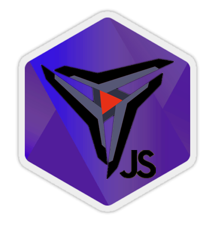

<h1 align="center">
    
</h1>

<h4 align="center">
  ⚔ ZedJS 👾
</h4>
<p align="center">
  

  

  <a href="https://github.com/jlenon7/ZedJS/commits/master">
    
  </a>

  <a href="https://github.com/jlenon7/ZedJS/issues">
    
  </a>

  
</p>

<p align="center">
  <a href="#-technology">🚀 Technology</a>&nbsp;&nbsp;&nbsp;|&nbsp;&nbsp;&nbsp;
  <a href="#-project">💻 Project</a>&nbsp;&nbsp;&nbsp;|&nbsp;&nbsp;&nbsp;
  <a href="#-tutorial">⏭ Tutorial</a>&nbsp;&nbsp;&nbsp;|&nbsp;&nbsp;&nbsp;
  <a href="#-how-to-contribute">🤔 How to contribute</a>&nbsp;&nbsp;&nbsp;|&nbsp;&nbsp;&nbsp;
  <a href="#-license">📝 License</a>
</p>

## 🚀 Technology

This project was developed with the following technologies:

- [NodeJS](https://nodejs.org/en/)
- [RiotAPI](https://developer.riotgames.com/)
- [DDragon](https://riot-api-libraries.readthedocs.io/en/latest/ddragon.html)

## 💻 Project

Fetch all the Riot API with ZedJS lib!

## ⏭ Tutorial

League of Legends:

```js
import { LolApi, Constants } from '@jlenon7/zedjs'

const api = new LolApi()

export async function summonerByNameExample () {
  return await api.Lol.Summoner.getByName('iLenon7', Constants.Regions.BRAZIL)
}
```

Teamfight Tatics:

```js
import { TftApi, Constants } from '@jlenon7/zedjs'

const api = new TftApi()

export async function matchListTft () {
  const {
    response: {
      puuid
    }
  } = api.Summoner.getByName('iLenon7', Constants.Regions.BRAZIL)
  return api.Match.list(puuid, Constants.TftRegions.TftRegions.AMERICAS)
}
```

---

## 🤔 How to contribute

- Fork this repository;
- Create a branch with your feature: `git checkout -b my-feature`;
- Commit your changes: `git commit -m 'feat: My new feature'`;
- Push to your branch: `git push origin my-feature`.

After the merge of your pull request is done, you can delete your branch.

## 📝 License

This project is under the MIT license. See the [LICENSE](LICENSE.md) for more details.

---

Made with 🖤 by [jlenon7](https://github.com/jlenon7) :wave:
